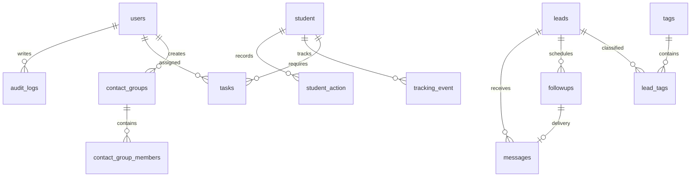

# Database operations

## Source of truth

- Fresh MySQL installation: `sql/production_schema.sql`
- Hostinger/phpMyAdmin installation: `sql/hostinger_production_schema.sql`
- Incremental changes after installation: ordered modules in `migrations/`
- Applied migration registry: database table `schema_migrations`

Files named `phase4` through `phase9`, `schema.sql`, and
`activation_engine_tables.sql` are historical upgrade references. They must not
be replayed against a current database.

## Relational model



`contact_group_members` is polymorphic: `contact_type` and `contact_id` refer to
either `leads` or `student`. MySQL cannot enforce that polymorphic foreign key,
so the service layer validates the referenced contact.

WhatsApp marketing is consent-gated on `leads.whatsapp_opt_in`. The timestamp
`whatsapp_opt_in_at` records when consent was captured and
`whatsapp_opt_out_at` blocks later sends. Existing leads default to no consent
when migration `20260714_001_whatsapp_consent.js` is applied.

## Migrations

Check status:

```bash
npm run db:migrate:status
```

Apply pending migrations:

```bash
npm run db:migrate
```

The runner authenticates with the normal `DB_*` environment variables, creates
`schema_migrations` when needed, and uses a MySQL advisory lock to prevent two
deployments from migrating concurrently. Migrations must be idempotent because
MySQL DDL statements may commit implicitly.

Production deployment order:

1. Create a verified backup.
2. Deploy code without starting the new process.
3. Run `npm ci --omit=dev`.
4. Run `npm run db:migrate`.
5. Confirm `npm run db:migrate:status` shows no pending migration.
6. Start or reload the API and verify `/health/ready`.

On Hostinger managed Node.js hosting, npm commands are not exposed through SSH.
The `prestart` lifecycle therefore runs `scripts/migrate.js` automatically with
the application environment before every API start. Already-applied migrations
are skipped. A migration failure prevents the new process from becoming ready.

## Pagination contract

Collection endpoints accept positive `page` and `limit` query parameters. The
maximum limit is 250 and the default bound is 100.

```json
{
  "data": [],
  "pagination": {
    "page": 1,
    "limit": 100,
    "total": 0,
    "total_pages": 0,
    "has_next": false,
    "has_previous": false
  }
}
```

Calls without `page` and `limit` temporarily retain the legacy array response,
but are still bounded to 100 rows and return an `X-Pagination-Deprecated`
header. New clients must use the paginated contract.

## Backup and restore

Create a transactionally consistent backup:

```bash
mysqldump --single-transaction --routines --triggers --set-gtid-purged=OFF \
  -h <DB_HOST> -u <DB_USER> -p <DB_NAME> > invincibo-crm.sql
```

Restore only into an empty staging database first:

```bash
mysql -h <DB_HOST> -u <DB_USER> -p <STAGING_DB_NAME> < invincibo-crm.sql
```

After restoration, run `npm run db:migrate:status`, start the API against the
staging database, verify readiness, authentication, counts, and a representative
lead/student workflow. A backup is not considered valid until this restoration
test succeeds.
